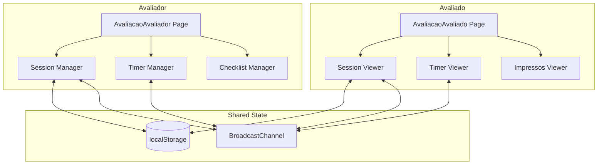

# Design Document - Avaliação em Tempo Real

## Overview

Este documento descreve o design técnico para o sistema de avaliação em tempo real do Revalida. O sistema permite que avaliadores conduzam avaliações de candidatos de forma sincronizada, com visões distintas para cada papel (avaliador vs avaliado).

A arquitetura utiliza localStorage para persistência de sessões e BroadcastChannel API para sincronização em tempo real entre abas do navegador. Para uma versão futura com múltiplos dispositivos, pode-se migrar para WebSockets.

## Architecture



### Fluxo Principal

1. Avaliador cria sessão → gera código único → salva no localStorage
2. Avaliador copia link e envia para avaliado
3. Avaliado acessa link → carrega sessão do localStorage → aguarda início
4. Avaliador inicia → BroadcastChannel notifica avaliado → cronômetro sincronizado
5. Durante avaliação: avaliador marca checklist, libera impressos
6. Ao finalizar: resultado calculado e exibido

## Components and Interfaces

### Novas Páginas

```typescript
// src/pages/AvaliacaoAvaliador.tsx
// Visão completa do avaliador com checklist, controles e painel de link

// src/pages/AvaliacaoAvaliado.tsx  
// Visão limitada do avaliado com cenário, instruções e impressos liberados
```

### Hooks

```typescript
// src/hooks/useAvaliacaoSession.ts
interface UseAvaliacaoSession {
  session: AvaliacaoSession | null;
  createSession: (checklistId: string, avaliadorName: string) => string;
  loadSession: (sessionCode: string) => AvaliacaoSession | null;
  updateSession: (updates: Partial<AvaliacaoSession>) => void;
  getSessionLink: (sessionCode: string) => string;
}

// src/hooks/useAvaliacaoTimer.ts
interface UseAvaliacaoTimer {
  timeRemaining: number; // em segundos
  isRunning: boolean;
  isPaused: boolean;
  start: () => void;
  pause: () => void;
  resume: () => void;
  stop: () => void;
}

// src/hooks/useAvaliacaoSync.ts
interface UseAvaliacaoSync {
  subscribe: (sessionCode: string, callback: (state: SessionState) => void) => void;
  broadcast: (sessionCode: string, state: SessionState) => void;
  unsubscribe: () => void;
}
```

### Componentes UI

```typescript
// src/components/avaliacao/SessionLinkPanel.tsx
// Painel com código da sessão e botões copiar link/código

// src/components/avaliacao/TimerDisplay.tsx
// Display do cronômetro com controles (avaliador) ou apenas visualização (avaliado)

// src/components/avaliacao/ChecklistEvaluator.tsx
// Checklist interativo para o avaliador marcar pontuações

// src/components/avaliacao/ImpressoItem.tsx
// Item de impresso com cadeado (avaliador) ou conteúdo (avaliado quando liberado)

// src/components/avaliacao/WaitingScreen.tsx
// Tela de espera para o avaliado antes do início

// src/components/avaliacao/ResultSummary.tsx
// Resumo do resultado final
```

## Data Models

```typescript
// src/types/avaliacao.ts

type SessionStatus = 'aguardando' | 'em_andamento' | 'pausado' | 'finalizado';

interface AvaliacaoSession {
  code: string;                    // Código único da sessão (ex: "TE1766432825222C")
  checklistId: string;             // ID do checklist selecionado
  checklistTitle: string;          // Título do checklist
  areaCode: string;                // Código da área (CM, CR, GO, PE, PR)
  avaliadorName: string;           // Nome do avaliador
  avaliadoName?: string;           // Nome do avaliado (quando conecta)
  status: SessionStatus;           // Status atual da sessão
  createdAt: number;               // Timestamp de criação
  startedAt?: number;              // Timestamp de início
  finishedAt?: number;             // Timestamp de finalização
  timeRemaining: number;           // Tempo restante em segundos (600 = 10 min)
  totalDuration: number;           // Duração total em segundos (600)
  
  // Pontuações
  scores: Record<number, ItemScore>; // itemId -> pontuação
  totalScore: number;              // Pontuação total atual
  maxScore: number;                // Pontuação máxima possível
  
  // Impressos liberados
  unlockedImpressos: number[];     // IDs dos impressos desbloqueados
  
  // Resultado compartilhado
  resultShared: boolean;           // Se o resultado foi compartilhado com avaliado
}

interface ItemScore {
  itemId: number;
  score: number;                   // Pontuação selecionada
  type: 'adequate' | 'partial' | 'inadequate';
}

interface SessionState {
  status: SessionStatus;
  timeRemaining: number;
  unlockedImpressos: number[];
  avaliadoConnected: boolean;
  resultShared: boolean;
}

// Mensagens do BroadcastChannel
type SyncMessage = 
  | { type: 'STATE_UPDATE'; sessionCode: string; state: SessionState }
  | { type: 'AVALIADO_CONNECTED'; sessionCode: string; name: string }
  | { type: 'IMPRESSO_UNLOCKED'; sessionCode: string; impressoId: number }
  | { type: 'IMPRESSO_LOCKED'; sessionCode: string; impressoId: number }
  | { type: 'TIMER_TICK'; sessionCode: string; timeRemaining: number }
  | { type: 'SESSION_STARTED'; sessionCode: string }
  | { type: 'SESSION_PAUSED'; sessionCode: string }
  | { type: 'SESSION_FINISHED'; sessionCode: string };
```

## Correctness Properties

*A property is a characteristic or behavior that should hold true across all valid executions of a system-essentially, a formal statement about what the system should do. Properties serve as the bridge between human-readable specifications and machine-verifiable correctness guarantees.*

### Property 1: Códigos de sessão são únicos
*For any* conjunto de sessões criadas, todos os códigos de sessão devem ser distintos entre si.
**Validates: Requirements 1.1**

### Property 2: Link contém código da sessão
*For any* sessão criada, o link gerado deve conter o código da sessão e ser uma URL válida.
**Validates: Requirements 1.2, 1.6**

### Property 3: Restauração de sessão preserva estado
*For any* sessão salva, ao restaurar a sessão, o estado retornado deve ser equivalente ao estado original (round-trip).
**Validates: Requirements 1.4**

### Property 4: Visão do avaliado não contém checklist
*For any* sessão em qualquer status, a visão do avaliado nunca deve conter dados do checklist ou pontuações.
**Validates: Requirements 2.3**

### Property 5: Iniciar sessão define tempo correto
*For any* sessão ao ser iniciada, o tempo restante deve ser igual à duração total (10 minutos = 600 segundos).
**Validates: Requirements 3.1**

### Property 6: Pausar preserva tempo restante
*For any* sessão pausada, o tempo restante deve ser preservado e não decrementar enquanto pausado.
**Validates: Requirements 3.2**

### Property 7: Finalizar calcula resultado
*For any* sessão finalizada, o resultado deve conter pontuação total calculada corretamente a partir das pontuações individuais.
**Validates: Requirements 3.3**

### Property 8: Pontuação parcial é soma das pontuações
*For any* conjunto de pontuações registradas, o total parcial deve ser igual à soma das pontuações individuais.
**Validates: Requirements 4.1, 4.2, 4.3**

### Property 9: Porcentagem final é correta
*For any* avaliação completa, a porcentagem final deve ser (pontuação total / pontuação máxima) * 100.
**Validates: Requirements 4.4**

### Property 10: Resultado contém todos os campos
*For any* resultado de avaliação, deve conter pontuação total, porcentagem e lista de itens avaliados.
**Validates: Requirements 5.1, 5.3**

### Property 11: Impressos bloqueados não aparecem para avaliado
*For any* impresso bloqueado, ele não deve aparecer na lista de impressos visíveis para o avaliado.
**Validates: Requirements 8.3**

### Property 12: Impressos liberados aparecem para avaliado
*For any* impresso liberado, ele deve aparecer na lista de impressos visíveis para o avaliado com conteúdo completo.
**Validates: Requirements 8.1, 8.4**

### Property 13: Bloquear impresso remove da visão do avaliado
*For any* impresso que foi liberado e depois bloqueado, ele deve ser removido da lista de impressos visíveis para o avaliado.
**Validates: Requirements 8.5**

## Error Handling

| Cenário | Tratamento |
|---------|------------|
| Sessão não encontrada | Exibir mensagem "Sessão não encontrada ou expirada" com botão para voltar |
| Sessão expirada | Exibir mensagem "Esta sessão expirou" |
| Perda de conexão | Tentar reconectar automaticamente, exibir indicador de "Reconectando..." |
| Falha ao copiar link | Exibir toast de erro com opção de copiar manualmente |
| localStorage cheio | Limpar sessões antigas (> 24h) automaticamente |

## Testing Strategy

### Abordagem Dual de Testes

O sistema utilizará tanto testes unitários quanto testes baseados em propriedades (property-based testing) para garantir corretude.

### Biblioteca de Property-Based Testing

Utilizaremos **fast-check** para TypeScript/JavaScript, que é a biblioteca mais madura e bem mantida para PBT no ecossistema.

```bash
npm install --save-dev fast-check
```

### Testes Unitários

- Testar funções de geração de código de sessão
- Testar cálculos de pontuação
- Testar formatação de tempo
- Testar serialização/deserialização de sessão

### Testes de Propriedade

Cada propriedade definida na seção "Correctness Properties" será implementada como um teste de propriedade usando fast-check.

Formato do comentário em cada teste:
```typescript
// **Feature: avaliacao-tempo-real, Property 1: Códigos de sessão são únicos**
```

### Configuração dos Testes

- Cada teste de propriedade deve executar no mínimo 100 iterações
- Usar geradores inteligentes que constrainem o espaço de entrada
- Testes devem ser independentes e não depender de estado externo

### Estrutura de Arquivos de Teste

```
src/
  hooks/
    __tests__/
      useAvaliacaoSession.test.ts
      useAvaliacaoSession.property.test.ts
  lib/
    __tests__/
      avaliacao-utils.test.ts
      avaliacao-utils.property.test.ts
```
