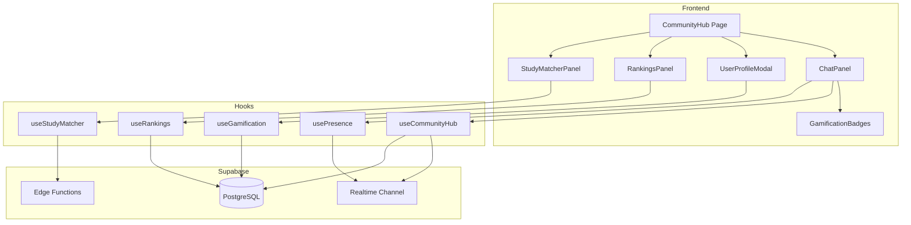

# Design Document: Community Hub

## Overview

O Community Hub é uma evolução do Chat Global que transforma a experiência de estudo solitário em uma comunidade social gamificada. O sistema integra chat em tempo real, perfis públicos com estatísticas, sistema de gamificação com níveis e badges, rankings inteligentes com filtros, e um algoritmo de matchmaking para encontrar parceiros de estudo compatíveis.

A arquitetura utiliza Supabase Realtime para comunicação em tempo real, PostgreSQL para persistência de dados, e React com TypeScript no frontend.

## Architecture



## Components and Interfaces

### Database Schema

```sql
-- Extensão da tabela profiles existente
ALTER TABLE profiles ADD COLUMN IF NOT EXISTS
  study_goal TEXT,                    -- "Revalida 2026", "INEP 2025"
  main_module TEXT,                   -- "Clínica Médica", "Cirurgia"
  total_points INTEGER DEFAULT 0,
  level TEXT DEFAULT 'bronze',        -- bronze, prata, ouro, diamante, elite
  is_profile_public BOOLEAN DEFAULT true,
  show_in_rankings BOOLEAN DEFAULT true,
  allow_study_invites BOOLEAN DEFAULT true;

-- Tabela de badges do usuário
CREATE TABLE user_badges (
  id UUID PRIMARY KEY DEFAULT gen_random_uuid(),
  user_id UUID REFERENCES auth.users(id) ON DELETE CASCADE,
  badge_type TEXT NOT NULL,           -- 'studying_now', 'top_week', '100h_studied', 'streak_7', 'streak_30'
  earned_at TIMESTAMPTZ DEFAULT NOW(),
  UNIQUE(user_id, badge_type)
);

-- Tabela de convites de estudo
CREATE TABLE study_invites (
  id UUID PRIMARY KEY DEFAULT gen_random_uuid(),
  sender_id UUID REFERENCES auth.users(id) ON DELETE CASCADE,
  receiver_id UUID REFERENCES auth.users(id) ON DELETE CASCADE,
  status TEXT DEFAULT 'pending',      -- pending, accepted, declined
  message TEXT,
  created_at TIMESTAMPTZ DEFAULT NOW(),
  responded_at TIMESTAMPTZ
);

-- Tabela de sessões de estudo (para tracking de horários)
CREATE TABLE study_sessions_log (
  id UUID PRIMARY KEY DEFAULT gen_random_uuid(),
  user_id UUID REFERENCES auth.users(id) ON DELETE CASCADE,
  started_at TIMESTAMPTZ DEFAULT NOW(),
  ended_at TIMESTAMPTZ,
  session_type TEXT,                  -- 'checklist', 'flashcard', 'resumo'
  module TEXT
);

-- Tabela de métricas da comunidade
CREATE TABLE community_metrics (
  id UUID PRIMARY KEY DEFAULT gen_random_uuid(),
  user_id UUID REFERENCES auth.users(id) ON DELETE CASCADE,
  date DATE DEFAULT CURRENT_DATE,
  chat_time_seconds INTEGER DEFAULT 0,
  messages_sent INTEGER DEFAULT 0,
  invites_sent INTEGER DEFAULT 0,
  invites_accepted INTEGER DEFAULT 0,
  UNIQUE(user_id, date)
);

-- Extensão da tabela user_presence
ALTER TABLE user_presence ADD COLUMN IF NOT EXISTS
  activity_type TEXT DEFAULT 'online', -- 'online', 'studying', 'away', 'offline'
  current_module TEXT;
```

### TypeScript Interfaces

```typescript
// types/community.ts

export type UserLevel = 'bronze' | 'prata' | 'ouro' | 'diamante' | 'elite';
export type BadgeType = 'studying_now' | 'top_week' | '100h_studied' | 'streak_7' | 'streak_30' | 'first_checklist';
export type ActivityType = 'online' | 'studying' | 'away' | 'offline';
export type InviteStatus = 'pending' | 'accepted' | 'declined';

export interface CommunityProfile {
  id: string;
  full_name: string;
  avatar_url: string | null;
  study_goal: string | null;
  main_module: string | null;
  total_points: number;
  level: UserLevel;
  is_profile_public: boolean;
  show_in_rankings: boolean;
  allow_study_invites: boolean;
  // Computed stats
  total_study_hours: number;
  daily_average_hours: number;
  weekly_average_hours: number;
  checklist_completion_rate: number;
  current_streak: number;
  badges: BadgeType[];
  last_activity: string;
}

export interface UserPresenceExtended {
  user_id: string;
  status: ActivityType;
  current_module: string | null;
  last_seen: string;
  user: {
    full_name: string;
    avatar_url: string | null;
    level: UserLevel;
    badges: BadgeType[];
  };
}

export interface StudyInvite {
  id: string;
  sender_id: string;
  receiver_id: string;
  status: InviteStatus;
  message: string | null;
  created_at: string;
  sender?: CommunityProfile;
  receiver?: CommunityProfile;
}

export interface StudyMatch {
  user: CommunityProfile;
  compatibility_score: number;
  matching_criteria: {
    dedication_match: number;    // 0-40
    goal_match: number;          // 0-30
    schedule_match: number;      // 0-20
    module_match: number;        // 0-10
  };
}

export interface RankingEntry {
  rank: number;
  user: CommunityProfile;
  metric_value: number;
  metric_label: string;
}

export type RankingFilter = 'top_week' | 'top_day' | 'most_improved' | 'same_goal' | 'same_module';

export interface ChatMessageExtended {
  id: string;
  user_id: string;
  content: string;
  created_at: string;
  user: {
    full_name: string;
    avatar_url: string | null;
    level: UserLevel;
    badges: BadgeType[];
    is_studying: boolean;
  };
}

// Gamification constants
export const LEVEL_THRESHOLDS: Record<UserLevel, { min: number; max: number }> = {
  bronze: { min: 0, max: 500 },
  prata: { min: 501, max: 2000 },
  ouro: { min: 2001, max: 5000 },
  diamante: { min: 5001, max: 10000 },
  elite: { min: 10001, max: Infinity }
};

export const POINTS_CONFIG = {
  per_study_hour: 10,
  per_checklist_completed: 50,
  per_streak_day: 20
};

export const BADGE_CRITERIA: Record<BadgeType, string> = {
  studying_now: 'Usuário está estudando agora',
  top_week: 'Top 3 da semana',
  '100h_studied': 'Mais de 100 horas estudadas',
  streak_7: 'Streak de 7 dias',
  streak_30: 'Streak de 30 dias',
  first_checklist: 'Primeiro checklist completado'
};
```

### Component Structure

```
src/
├── components/
│   └── community/
│       ├── CommunityHub.tsx           # Main container component
│       ├── ChatPanel.tsx              # Enhanced chat with badges
│       ├── UserProfileModal.tsx       # Profile slide-out panel
│       ├── RankingsPanel.tsx          # Rankings with filters
│       ├── StudyMatcherPanel.tsx      # Partner matching UI
│       ├── OnlineUsersBar.tsx         # Active users strip
│       ├── LevelBadge.tsx             # Level indicator component
│       ├── AchievementBadge.tsx       # Badge display component
│       └── StudyInviteCard.tsx        # Invite notification card
├── hooks/
│   ├── useCommunityHub.ts             # Main community logic
│   ├── useGamification.ts             # Points, levels, badges
│   ├── useRankings.ts                 # Rankings with filters
│   ├── useStudyMatcher.ts             # Matching algorithm
│   └── useAdvancedPresence.ts         # Enhanced presence tracking
└── types/
    └── community.ts                   # Type definitions
```

## Data Models

### Level Calculation

```typescript
function calculateLevel(points: number): UserLevel {
  if (points >= 10001) return 'elite';
  if (points >= 5001) return 'diamante';
  if (points >= 2001) return 'ouro';
  if (points >= 501) return 'prata';
  return 'bronze';
}

function calculateLevelProgress(points: number): number {
  const level = calculateLevel(points);
  const { min, max } = LEVEL_THRESHOLDS[level];
  if (max === Infinity) return 100;
  return ((points - min) / (max - min)) * 100;
}
```

### Compatibility Algorithm

```typescript
function calculateCompatibility(user1: CommunityProfile, user2: CommunityProfile): StudyMatch {
  let score = 0;
  const criteria = { dedication_match: 0, goal_match: 0, schedule_match: 0, module_match: 0 };
  
  // Dedication match (40%) - Similar study hours
  const hoursDiff = Math.abs(user1.total_study_hours - user2.total_study_hours);
  const maxHours = Math.max(user1.total_study_hours, user2.total_study_hours, 1);
  criteria.dedication_match = Math.round((1 - hoursDiff / maxHours) * 40);
  
  // Goal match (30%) - Same study goal
  if (user1.study_goal === user2.study_goal) {
    criteria.goal_match = 30;
  } else if (user1.study_goal?.includes('Revalida') && user2.study_goal?.includes('Revalida')) {
    criteria.goal_match = 15;
  }
  
  // Schedule match (20%) - Overlapping study times (requires session log analysis)
  // Simplified: based on last activity proximity
  criteria.schedule_match = calculateScheduleOverlap(user1.id, user2.id);
  
  // Module match (10%) - Same main module
  if (user1.main_module === user2.main_module) {
    criteria.module_match = 10;
  }
  
  score = criteria.dedication_match + criteria.goal_match + criteria.schedule_match + criteria.module_match;
  
  return { user: user2, compatibility_score: score, matching_criteria: criteria };
}
```

## Correctness Properties

*A property is a characteristic or behavior that should hold true across all valid executions of a system-essentially, a formal statement about what the system should do. Properties serve as the bridge between human-readable specifications and machine-verifiable correctness guarantees.*

### Property 1: Level Calculation Consistency
*For any* user with a given point total, the calculated level SHALL always be deterministic and within the defined thresholds.
**Validates: Requirements 3.2**

### Property 2: Compatibility Score Bounds
*For any* two users, the compatibility score SHALL always be between 0 and 100, and the sum of criteria scores SHALL equal the total compatibility score.
**Validates: Requirements 5.2**

### Property 3: Points Accumulation Integrity
*For any* study activity, points SHALL be awarded exactly once and the total SHALL be the sum of all individual point awards.
**Validates: Requirements 3.1**

### Property 4: Presence State Transitions
*For any* user, presence status transitions SHALL follow valid paths: online→studying→away→offline, and studying status SHALL only be set when user is on a study page.
**Validates: Requirements 6.2, 6.5, 6.6**

### Property 5: Privacy Enforcement
*For any* user with private profile, detailed statistics SHALL NOT be visible to other users, only basic info (name, avatar, level).
**Validates: Requirements 7.2, 7.3**

### Property 6: Ranking Filter Correctness
*For any* ranking filter, all returned users SHALL match the filter criteria (same goal, same module, etc.).
**Validates: Requirements 4.4, 4.5**

## Error Handling

| Error Scenario | Handling Strategy |
|----------------|-------------------|
| Realtime connection lost | Show reconnecting indicator, queue messages locally, retry with exponential backoff |
| Profile load failure | Show skeleton loader, retry 3 times, show error state with retry button |
| Matching algorithm timeout | Return partial results with "Carregando mais..." indicator |
| Invalid study invite | Validate sender/receiver exist, show toast error if invalid |
| Points calculation error | Log error, don't update points, alert admin |
| Presence update failure | Continue with stale data, retry silently in background |

## Testing Strategy

### Unit Tests
- Level calculation with boundary values (500, 501, 2000, 2001, etc.)
- Compatibility score calculation with various user profiles
- Points accumulation for different activity types
- Badge eligibility checks
- Privacy filter application

### Property-Based Tests
- Level calculation always returns valid level for any point value
- Compatibility score always between 0-100
- Ranking filters always return matching users
- Presence transitions follow valid state machine

### Integration Tests
- Real-time message delivery and display
- Profile modal data loading
- Ranking updates on new activity
- Study invite flow (send → receive → accept/decline)
- Presence status updates across components
