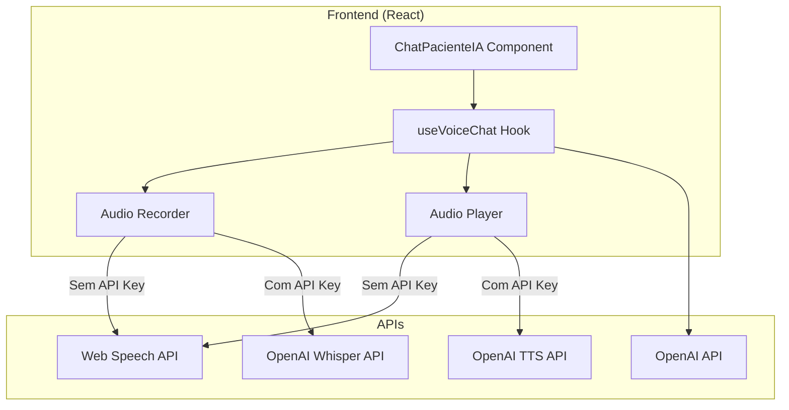

# Design Document: Sistema de Conversa por Voz em Tempo Real

## Overview

Este documento descreve a arquitetura e implementação do sistema de conversa por voz em tempo real para o treino com IA. O sistema permite comunicação bidirecional de áudio entre o usuário e o paciente simulado por IA, usando a OpenAI Realtime API quando disponível ou Web Speech API como fallback.

## Architecture



## Components and Interfaces

### 1. useVoiceChat Hook

Hook principal que gerencia toda a lógica de voz.

```typescript
interface UseVoiceChatOptions {
  apiKey?: string;
  voice?: 'alloy' | 'echo' | 'fable' | 'onyx' | 'nova' | 'shimmer';
  onTranscript?: (text: string, isFinal: boolean) => void;
  onAudioStart?: () => void;
  onAudioEnd?: () => void;
  onError?: (error: string) => void;
}

interface UseVoiceChatReturn {
  // Recording
  startRecording: () => Promise<void>;
  stopRecording: () => Promise<string | null>;
  isRecording: boolean;
  
  // Playback
  speak: (text: string) => Promise<void>;
  stopSpeaking: () => void;
  isSpeaking: boolean;
  
  // State
  isProcessing: boolean;
  error: string | null;
  hasPermission: boolean;
  
  // Transcript
  interimTranscript: string;
}
```

### 2. Audio Recorder Module

Módulo para captura de áudio do microfone.

```typescript
interface AudioRecorderOptions {
  sampleRate?: number;
  channelCount?: number;
  onDataAvailable?: (data: Blob) => void;
}

class AudioRecorder {
  start(): Promise<void>;
  stop(): Promise<Blob>;
  isRecording: boolean;
}
```

### 3. OpenAI Speech Services

Serviços para STT (Speech-to-Text) e TTS (Text-to-Speech).

```typescript
// Speech-to-Text usando Whisper
async function transcribeAudio(
  audioBlob: Blob, 
  apiKey: string
): Promise<string>;

// Text-to-Speech usando TTS API
async function synthesizeSpeech(
  text: string, 
  apiKey: string, 
  voice: string
): Promise<Blob>;
```

## Data Models

### VoiceChatState

```typescript
interface VoiceChatState {
  isRecording: boolean;
  isSpeaking: boolean;
  isProcessing: boolean;
  hasPermission: boolean;
  error: string | null;
  interimTranscript: string;
}
```

### AudioConfig

```typescript
interface AudioConfig {
  sampleRate: number;
  channelCount: number;
  mimeType: string;
}

const DEFAULT_AUDIO_CONFIG: AudioConfig = {
  sampleRate: 16000,
  channelCount: 1,
  mimeType: 'audio/webm;codecs=opus'
};
```

## Correctness Properties

*A property is a characteristic or behavior that should hold true across all valid executions of a system-essentially, a formal statement about what the system should do. Properties serve as the bridge between human-readable specifications and machine-verifiable correctness guarantees.*

### Property 1: Recording state consistency
*For any* voice chat session, when startRecording is called and succeeds, isRecording SHALL be true until stopRecording is called
**Validates: Requirements 1.1, 1.5**

### Property 2: Audio playback exclusivity
*For any* voice chat session, isSpeaking and isRecording SHALL NOT both be true simultaneously
**Validates: Requirements 1.4, 2.2**

### Property 3: Transcript generation
*For any* successful recording that produces audio, stopRecording SHALL return a non-empty transcript string
**Validates: Requirements 3.1**

### Property 4: Error recovery
*For any* error state, the system SHALL allow retry by calling startRecording again
**Validates: Requirements 3.3, 6.4**

### Property 5: Mode switching preservation
*For any* switch between voice and text mode, conversation history SHALL remain unchanged
**Validates: Requirements 4.3**

## Error Handling

| Error Type | Handling Strategy |
|------------|-------------------|
| Microphone permission denied | Display clear message with instructions to enable |
| API key invalid | Fall back to Web Speech API |
| Network error | Retry with exponential backoff, then fallback |
| Audio playback error | Log error, continue with text-only |
| Transcription failed | Show error, allow manual text input |

## Testing Strategy

### Unit Tests
- Test state transitions (recording → processing → idle)
- Test error handling for each error type
- Test fallback logic when API key is missing

### Property-Based Tests
- Property 1: Recording state consistency
- Property 2: Audio playback exclusivity
- Property 5: Mode switching preservation

### Integration Tests
- Test full flow: record → transcribe → respond → play
- Test fallback to Web Speech API
- Test with various audio durations
