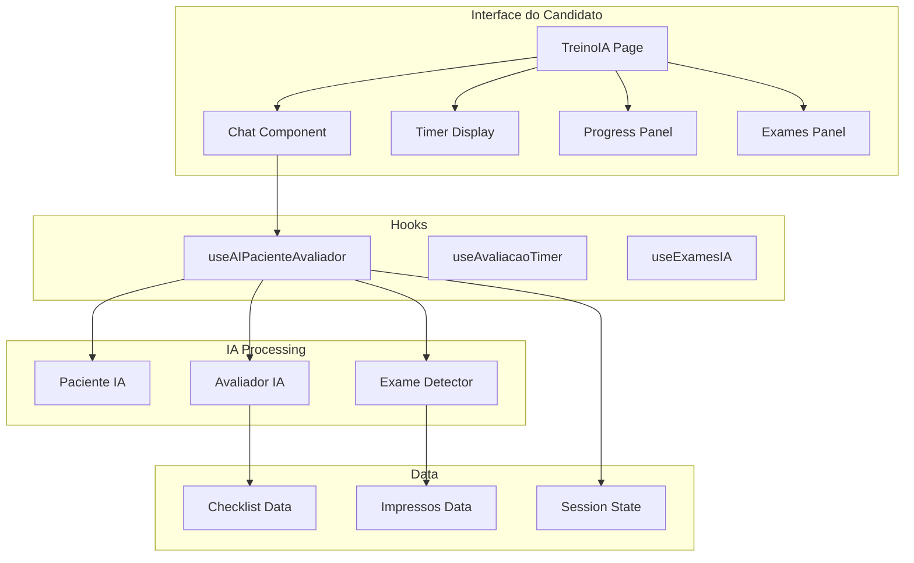

# Design Document - Treino com IA Completo

## Overview

Este documento descreve o design técnico para o sistema de treino com IA completo do Revalida. O sistema simula uma estação OSCE onde a IA atua como paciente (respondendo perguntas) e avaliador (pontuando automaticamente). A IA também libera exames quando solicitados durante a consulta.

A arquitetura utiliza a API da OpenAI (GPT-4o-mini) para processamento de linguagem natural, com fallback para respostas locais quando não há API key configurada.

## Architecture



### Fluxo Principal

1. Candidato inicia sessão → carrega caso clínico e checklist
2. Candidato envia mensagem → IA processa como paciente e avaliador
3. IA responde como paciente + analisa checklist + detecta solicitação de exames
4. Se exame solicitado → libera impresso automaticamente
5. Progresso atualizado em tempo real
6. Ao finalizar → exibe resultado completo

## Components and Interfaces

### Hook Principal

```typescript
// src/hooks/useAIPacienteAvaliador.ts
interface UseAIPacienteAvaliadorOptions {
  checklistContent: ChecklistContent;
  apiKey?: string;
  onChecklistItemCompleted?: (itemId: number, score: ItemScore) => void;
  onExameLiberated?: (exameId: number) => void;
}

interface UseAIPacienteAvaliadorReturn {
  sendMessage: (message: string) => Promise<AIResponse>;
  isLoading: boolean;
  conversationHistory: Message[];
  completedItems: Record<number, ItemScore>;
  liberatedExames: number[];
  clearHistory: () => void;
}

interface AIResponse {
  pacienteResponse: string;           // Resposta do paciente
  detectedChecklistItems: number[];   // Itens do checklist detectados
  detectedExames: number[];           // Exames solicitados detectados
  evaluationFeedback?: string;        // Feedback opcional da avaliação
}
```

### Componentes UI

```typescript
// src/components/treino-ia/ChatPacienteIA.tsx
// Chat com o paciente IA - similar ao AIPacienteChat mas integrado com avaliação

// src/components/treino-ia/ProgressoAvaliacao.tsx
// Painel mostrando progresso da avaliação em tempo real

// src/components/treino-ia/ExamesLiberados.tsx
// Lista de exames liberados durante a consulta

// src/components/treino-ia/FeedbackItem.tsx
// Notificação quando um item do checklist é completado
```

### Página Principal

```typescript
// src/pages/TreinoIACompleto.tsx
// Página principal do treino com layout integrado
```

## Data Models

```typescript
// src/types/treino-ia.ts

interface TreinoIASession {
  id: string;
  checklistId: string;
  checklistTitle: string;
  areaCode: string;
  startedAt: number;
  finishedAt?: number;
  timeRemaining: number;
  status: 'setup' | 'running' | 'paused' | 'finished';
  
  // Avaliação
  completedItems: Record<number, ItemScore>;
  totalScore: number;
  maxScore: number;
  
  // Exames
  liberatedExames: number[];
  
  // Histórico
  conversationHistory: Message[];
}

interface Message {
  id: string;
  role: 'user' | 'assistant' | 'system';
  content: string;
  timestamp: Date;
  metadata?: {
    detectedItems?: number[];
    detectedExames?: number[];
  };
}

interface ItemScore {
  itemId: number;
  score: number;
  type: 'adequate' | 'partial' | 'inadequate';
  detectedAt: number;
  fromMessage: string;
}

// Prompt para a IA
interface AIPromptContext {
  scenario: string;
  patientScript: string;
  checklistItems: ChecklistItem[];
  availableExames: Impresso[];
  conversationHistory: Message[];
}
```

## Correctness Properties

*A property is a characteristic or behavior that should hold true across all valid executions of a system-essentially, a formal statement about what the system should do. Properties serve as the bridge between human-readable specifications and machine-verifiable correctness guarantees.*

### Property 1: Resposta da IA é retornada
*For any* mensagem enviada pelo candidato, o sistema deve retornar uma resposta do paciente IA.
**Validates: Requirements 1.2**

### Property 2: Itens detectados são marcados
*For any* item do checklist detectado em uma mensagem, o item deve ser marcado como completado no estado da sessão.
**Validates: Requirements 2.1, 2.5**

### Property 3: Progresso é calculado corretamente
*For any* conjunto de itens completados, o progresso exibido deve ser igual a (itens completados / total de itens).
**Validates: Requirements 2.2**

### Property 4: Resultado contém todos os campos
*For any* sessão finalizada, o resultado deve conter pontuação total, porcentagem e lista de todos os itens do checklist.
**Validates: Requirements 2.4, 5.1, 5.2**

### Property 5: Exames solicitados são liberados
*For any* solicitação de exame válida (exame existe no caso), o exame deve ser adicionado à lista de exames liberados.
**Validates: Requirements 3.1**

### Property 6: Exames liberados têm conteúdo
*For any* exame na lista de liberados, o conteúdo completo do documento deve estar disponível.
**Validates: Requirements 3.3**

### Property 7: Lista de exames é mantida
*For any* sessão em andamento, a lista de exames disponíveis e liberados deve ser consistente.
**Validates: Requirements 3.4**

### Property 8: Exames inexistentes retornam mensagem
*For any* solicitação de exame que não existe no caso, o sistema deve retornar uma mensagem informando indisponibilidade.
**Validates: Requirements 3.5**

### Property 9: Timer inicia com tempo correto
*For any* sessão iniciada, o cronômetro deve começar com 600 segundos (10 minutos).
**Validates: Requirements 4.1**

### Property 10: Pausar preserva tempo
*For any* sessão pausada, o tempo restante deve ser preservado e não decrementar.
**Validates: Requirements 4.2**

### Property 11: Pontuação final é correta
*For any* sessão finalizada, a pontuação total deve ser a soma das pontuações individuais dos itens completados.
**Validates: Requirements 5.1**

### Property 12: Itens não realizados são identificados
*For any* resultado de sessão, os itens do checklist não completados devem ser claramente identificados.
**Validates: Requirements 5.3**

### Property 13: Classificação é válida
*For any* item do checklist detectado, a classificação deve ser uma das três opções: adequado, parcial ou inadequado.
**Validates: Requirements 7.2**

### Property 14: Múltiplos itens são registrados
*For any* mensagem que contém múltiplas ações do checklist, todos os itens correspondentes devem ser registrados.
**Validates: Requirements 7.3**

### Property 15: Pontuação mais alta é preservada
*For any* item do checklist que já foi marcado, se uma nova detecção ocorrer com pontuação mais alta, a pontuação mais alta deve ser mantida.
**Validates: Requirements 7.4**

## Error Handling

| Cenário | Tratamento |
|---------|------------|
| API OpenAI indisponível | Usar respostas locais pré-programadas |
| Timeout na resposta | Exibir mensagem "Paciente pensando..." e tentar novamente |
| Exame não encontrado | Informar "Este exame não está disponível neste caso" |
| Erro de reconhecimento de voz | Exibir toast com opção de digitar manualmente |
| Sessão expirada | Salvar estado e permitir continuar |

## Testing Strategy

### Biblioteca de Property-Based Testing

Utilizaremos **fast-check** para TypeScript/JavaScript.

```bash
npm install --save-dev fast-check
```

### Testes Unitários

- Testar detecção de itens do checklist em mensagens
- Testar detecção de solicitação de exames
- Testar cálculo de pontuação
- Testar lógica de preservação de pontuação mais alta

### Testes de Propriedade

Cada propriedade definida na seção "Correctness Properties" será implementada como um teste de propriedade usando fast-check.

Formato do comentário em cada teste:
```typescript
// **Feature: treino-ia-completo, Property 1: Resposta da IA é retornada**
```

### Configuração dos Testes

- Cada teste de propriedade deve executar no mínimo 100 iterações
- Usar geradores inteligentes para mensagens e estados de sessão
- Testes devem ser independentes

### Estrutura de Arquivos de Teste

```
src/
  hooks/
    __tests__/
      useAIPacienteAvaliador.test.ts
      useAIPacienteAvaliador.property.test.ts
  lib/
    __tests__/
      checklist-detector.test.ts
      exame-detector.test.ts
```

## Prompt Engineering

### System Prompt para IA

```
Você é um sistema dual que atua como:

1. PACIENTE: Simule o paciente do caso clínico, respondendo às perguntas do médico.
2. AVALIADOR: Analise a mensagem do médico e identifique itens do checklist realizados.

CASO CLÍNICO:
{scenario}

SCRIPT DO PACIENTE:
{patientScript}

CHECKLIST DE AVALIAÇÃO:
{checklistItems}

EXAMES DISPONÍVEIS:
{availableExames}

FORMATO DE RESPOSTA (JSON):
{
  "pacienteResponse": "Resposta do paciente...",
  "detectedItems": [1, 3, 5],
  "detectedExames": [2],
  "itemScores": {
    "1": { "type": "adequate", "reason": "Perguntou corretamente sobre..." },
    "3": { "type": "partial", "reason": "Mencionou mas não aprofundou..." }
  }
}

REGRAS:
1. Responda como paciente de forma natural e realista
2. Identifique TODOS os itens do checklist mencionados na mensagem
3. Classifique cada item como adequate/partial/inadequate
4. Se o médico solicitar exame, inclua o ID do exame em detectedExames
5. Mantenha consistência com o histórico da conversa
```

</content>
