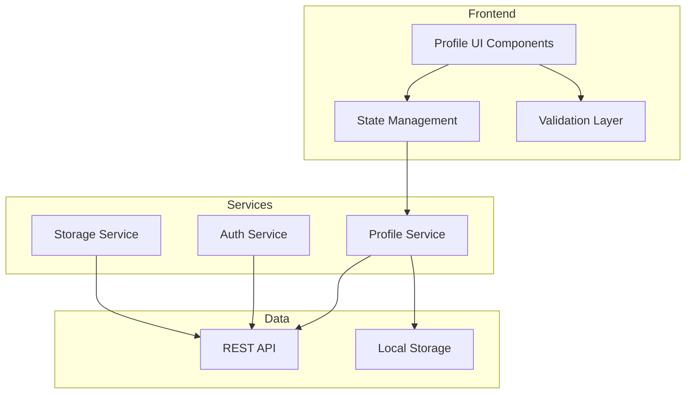

# Design Document - User Profile System

## Overview

O sistema de perfil de usuário é uma aplicação frontend que permite aos usuários gerenciar suas informações pessoais, preferências, segurança e privacidade. A arquitetura segue o padrão de componentes React com gerenciamento de estado centralizado e persistência via API REST.

## Architecture



## Components and Interfaces

### Core Components

#### ProfilePage
Componente principal que orquestra todas as seções do perfil.

```typescript
interface ProfilePageProps {
  userId: string;
}
```

#### PersonalInfoSection
Gerencia informações pessoais básicas.

```typescript
interface PersonalInfoSectionProps {
  personalInfo: PersonalInfo;
  onSave: (data: PersonalInfo) => Promise<void>;
  isEditing: boolean;
}
```

#### AvatarUploader
Componente para upload e gerenciamento de avatar.

```typescript
interface AvatarUploaderProps {
  currentAvatar: string | null;
  userName: string;
  onUpload: (file: File) => Promise<void>;
  onRemove: () => Promise<void>;
}
```

#### SecuritySettings
Gerencia configurações de segurança.

```typescript
interface SecuritySettingsProps {
  hasTwoFactor: boolean;
  onChangePassword: (oldPassword: string, newPassword: string) => Promise<void>;
  onToggleTwoFactor: (enable: boolean) => Promise<void>;
}
```

#### PreferencesSection
Gerencia preferências do usuário.

```typescript
interface PreferencesSectionProps {
  preferences: UserPreferences;
  onSave: (preferences: UserPreferences) => Promise<void>;
}
```

#### PrivacySettings
Controles de privacidade do perfil.

```typescript
interface PrivacySettingsProps {
  privacySettings: PrivacyConfig;
  onSave: (settings: PrivacyConfig) => Promise<void>;
}
```

### Services

#### ProfileService

```typescript
interface IProfileService {
  getProfile(userId: string): Promise<UserProfile>;
  updatePersonalInfo(userId: string, data: PersonalInfo): Promise<UserProfile>;
  updateAvatar(userId: string, file: File): Promise<string>;
  removeAvatar(userId: string): Promise<void>;
  updatePreferences(userId: string, prefs: UserPreferences): Promise<void>;
  updatePrivacy(userId: string, settings: PrivacyConfig): Promise<void>;
  updateAdditionalInfo(userId: string, data: AdditionalInfo): Promise<void>;
}
```

#### ValidationService

```typescript
interface IValidationService {
  validateEmail(email: string): ValidationResult;
  validatePassword(password: string): ValidationResult;
  validateDisplayName(name: string): ValidationResult;
  validateBio(bio: string): ValidationResult;
  validateUrl(url: string): ValidationResult;
  validateImageFile(file: File): ValidationResult;
}
```

## Data Models

### UserProfile

```typescript
interface UserProfile {
  id: string;
  personalInfo: PersonalInfo;
  avatar: AvatarInfo;
  accountInfo: AccountInfo;
  preferences: UserPreferences;
  privacy: PrivacyConfig;
  additionalInfo: AdditionalInfo;
  createdAt: string;
  updatedAt: string;
}
```

### PersonalInfo

```typescript
interface PersonalInfo {
  fullName: string;
  displayName: string;
  email: string;
  phone: string | null;
}
```

### AvatarInfo

```typescript
interface AvatarInfo {
  url: string | null;
  initials: string;
  backgroundColor: string;
}
```

### AccountInfo

```typescript
interface AccountInfo {
  status: 'free' | 'premium';
  premiumExpiresAt: string | null;
  createdAt: string;
  lastLoginAt: string;
}
```

### UserPreferences

```typescript
interface UserPreferences {
  language: string;
  theme: 'light' | 'dark' | 'system';
  notifications: NotificationSettings;
}

interface NotificationSettings {
  email: boolean;
  push: boolean;
  sms: boolean;
}
```

### PrivacyConfig

```typescript
interface PrivacyConfig {
  profileVisibility: 'public' | 'private';
  showEmail: boolean;
  showPhone: boolean;
  showLocation: boolean;
  showSocialLinks: boolean;
}
```

### AdditionalInfo

```typescript
interface AdditionalInfo {
  bio: string | null;
  location: string | null;
  website: string | null;
  socialLinks: SocialLinks;
}

interface SocialLinks {
  twitter: string | null;
  linkedin: string | null;
  github: string | null;
  instagram: string | null;
}
```

### ValidationResult

```typescript
interface ValidationResult {
  isValid: boolean;
  error: string | null;
}
```


## Correctness Properties

*A property is a characteristic or behavior that should hold true across all valid executions of a system-essentially, a formal statement about what the system should do. Properties serve as the bridge between human-readable specifications and machine-verifiable correctness guarantees.*

### Property 1: Display Name Validation
*For any* string, the display name validation should accept strings with 2-50 characters and reject strings outside this range.
**Validates: Requirements 1.2**

### Property 2: Email Validation
*For any* string, the email validation should accept only strings that match a valid email format (containing @ and valid domain) and reject all others.
**Validates: Requirements 1.4**

### Property 3: Image File Validation
*For any* file, the image validation should accept files with extensions JPG, PNG, or WebP with size up to 5MB, and reject files that don't meet these criteria.
**Validates: Requirements 2.2**

### Property 4: Avatar Initials Generation
*For any* user name, removing the avatar should result in initials being correctly generated from the first letters of the name parts.
**Validates: Requirements 2.4**

### Property 5: Password Validation
*For any* string, the password validation should accept strings with at least 8 characters containing at least one uppercase letter, one lowercase letter, and one number, and reject strings that don't meet all criteria.
**Validates: Requirements 4.2**

### Property 6: Bio Length Validation
*For any* string, the bio validation should accept strings with 0-500 characters and reject strings exceeding 500 characters.
**Validates: Requirements 7.2**

### Property 7: URL Validation
*For any* string, the URL validation should accept strings that match a valid URL format and reject invalid URLs.
**Validates: Requirements 7.3**

### Property 8: Privacy Visibility Filter
*For any* user profile and privacy configuration, fields marked as private should not appear in the public profile view.
**Validates: Requirements 6.2, 6.3**

### Property 9: Profile Serialization Round-Trip
*For any* valid UserProfile object, serializing to JSON and then deserializing should produce an equivalent object with all fields preserved.
**Validates: Requirements 8.1, 8.2, 8.3**

### Property 10: Preferences Persistence Round-Trip
*For any* valid UserPreferences object, saving and then loading preferences should return equivalent values.
**Validates: Requirements 5.4**

## Error Handling

### Validation Errors
- Exibir mensagens de erro específicas abaixo do campo inválido
- Destacar campos com erro visualmente (borda vermelha)
- Não permitir submit do formulário enquanto houver erros

### Network Errors
- Exibir toast de erro quando requisições falharem
- Manter dados locais em caso de falha de rede
- Oferecer opção de retry para operações falhadas

### Upload Errors
- Exibir mensagem específica para cada tipo de erro (formato, tamanho, rede)
- Manter avatar anterior em caso de falha
- Limpar preview de imagem em caso de erro

### Authentication Errors
- Redirecionar para login se sessão expirar
- Exibir mensagem clara sobre necessidade de reautenticação

## Testing Strategy

### Unit Testing
Utilizar Vitest para testes unitários dos componentes e serviços.

**Cobertura de testes unitários:**
- Funções de validação (email, senha, nome, bio, URL)
- Geração de iniciais do avatar
- Lógica de filtro de privacidade
- Serialização/deserialização de dados

### Property-Based Testing
Utilizar **fast-check** como biblioteca de property-based testing para TypeScript/JavaScript.

**Configuração:**
- Mínimo de 100 iterações por propriedade
- Cada teste deve referenciar a propriedade do design: `**Feature: user-profile, Property {number}: {property_text}**`

**Propriedades a serem testadas:**
1. Validação de display name (2-50 caracteres)
2. Validação de email (formato válido)
3. Validação de arquivo de imagem (formato e tamanho)
4. Geração de iniciais do avatar
5. Validação de senha (requisitos de complexidade)
6. Validação de bio (máximo 500 caracteres)
7. Validação de URL
8. Filtro de visibilidade de privacidade
9. Round-trip de serialização do perfil
10. Round-trip de persistência de preferências

### Integration Testing
- Testar fluxos completos de edição de perfil
- Testar upload de avatar end-to-end
- Testar alteração de configurações de segurança
